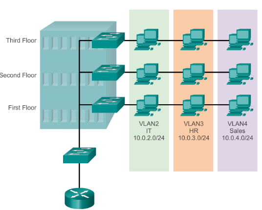

# TNE10006 Cheat Sheet
## 1. Reference Model and Data Encapsulation

**The OSI Reference Model**

**The TCP/IP Protocol Model**

**TCP/IP and OSI comparison**

**Protocol Data Units**

+ Data - The general term for the PDU used at the application layer.

+ Segment - Transport layer PDU.

+ Packet - Network layer PDU.

+ Frame - Data Link layer PDU.

+ Bits - Physical layer PDU used when physically transmitting data over the medium.

## 2. Physical layer

**Bandwidth Terminology**

+ **Bandwidth**: is the capacity at which a medium can carry data.

+ **Latency**: refers to the amount of time, including delays, for data to travel from one given point to another.

+ **Throughput**: is the measure of the transfer of bits accross the media over a given peroid of time.

+ **Goodput**: is the measure of usable data transferred over a given period of time.

## 3. Data Link layer

The Data Link Layer prepares network data for the physical network. It is responsible for network interface card to network interface card communications.

IEEE 802 LAN/MAN layer consists of two sublayers:
+ **Logical Link Control(LLC)**: This sublayer allows for communication between Data Link to upper layer.

+ **Media Access Control(MAC)**: THis sublayer is responsible for data Encapsulation and media access control to lower layer.

There are two types of topologies used when describing LAN and WAN:

+ **Physical topology**: Identifies the physical connections and how end devices and intermediary devices are connected.

+ **Logical topology**: Refers to the way a network transfers from one node to the next.

### 3.1 WAN topologies

+ **Point-to-Point**: consists of a permanent link between two endpoints.

+ **Hub and Spoke**: refers to the network where endpoints can only reach each other by going through the central site.

+ **Mesh**: Provide high availability but requires every end system to interconnect to every other system.

### 3.2 LAN topologies
In multiaccess LANs, end deviecs are interconnected using star or extended sta topologies, in which end devices are connected to a central intermediary device.

**Legacy LAN topologies**
Early Ethernet and legacy Token Ring LAN technologies include:

+ **Bus**: where all end systems are chained to each other and terminated in some form on each end.

++ **Ring**: End systems are connected to their respective neighbor forming a ring.

### 3.3 Half and Full Duplex communication

**Half-duplex communication** allows only one device to send or receive at a time on a shared medium.

**Full-duplex communication** allows devices to transmit and receive data simultaneously on the shared media.

### 3.4 Access Control Methods

There are two basic access control methods for shared media:

**Contention-based access** : Where all nodes are operating in half-duplex, competing for the use of the medium. However, only one device can send at a time. Therefore, methods are required to handle this:

* **Carrier sense multiple access with collision detection (CSMA/CD)** used on legacy bus-topology Ethernet LANs

* **Carrier sense mutiple access with collision avoidance (CSMA/CA)** on wireless LANs

**Controlled access**: each node has to wait for their turn to access the network medium

**CSMA/CD**:

If two devices transmit at the same time, a collision will occur. For legacy Ethernet LANs, both devices will detect the collision on the network. This is the collision detection(CD) portion of CSMA/CD.

 The NIC compares data transmitted with data received, or by recognizing that the signal amplitude is higher than normal on the media. The data sent by both devices will be corrupted and will need to be resent.

 **CSMA/CA**

CMSA/CA uses a method similar to CSMA/CD to detect if the media is clear. CMSA/CA uses additional techniques. In wireless environments it may not be possible for a device to detect a collision. CMSA/CA does not detect collisions but attempts to avoid them by waiting before transmitting.

device that transmits includes the time duration that it needs for the transmission. All other wireless devices receive this information and know how long the medium will be unavailable.

### 3.5 Fram Fields
Framing breaks the stream into decipherable groupings, with control information inserted in the header and trailer as values in different fields.

**1. Frame start and stop indicator flags**: used to identify the beginning and end limites of the frame.

**2. Addressing**: indicates the source and destination nodes on the media.

**3. Type**: Identifies the Layer 3 protocol in the data field.

**4. Control**: Identifies special flow control services such as quality of service(QoS) or voice over ip(VoIP)

**5. Data**: Contains the frame payload.

**6. Error Detection**: included after the data to form the trailer.

## 4. Ethernet Frames 

According to Maximum Transmission Unit (MTU), the minimum Ethernet frame size is 64 bytes and maximum is 1518 bytes(1500 data and 18 Ethernet bits)

**1. Preamble and Start Frame Delimiter Fields** are used to synchronize between sending and receiving devices. Preamble is 7 bytes SFD is 1 byte.

**2. Destination MAC address field**: 6 bytes of the identifier for the inteded recipent.

**3. Source MAC address field**: 6 byte identifier of the originating NIC.

**4. Type/Length** Identifier for upper layer protocol. IPv4 is 0x800, IPv6 is 0x86DD, ARP is 0x806. 2 bytes.

**Frame Check Sequence Field**: FCS consists of 4 bytes that is used to detect error in a frame. It uses a cyclic redundancy check (CRC) to check for changes in the data.

## 5. IPv4 

### 5.1 IPv4 header

**1. Version - 4bits**: Identify the version of IP used. IPv4 = 4 (0100), IPv6 = 6 (0110)

**2. Internet Header Length (IHL) - 4 bits**: This field is used to indicate the total length of the header.

This will identify the length of the header in **4-byte increments**, meaning that if the value of this field is 5 then the length of IPv4 is 20 bytes.

The minimum value of IPv4 header is 20 bytes (5 in IHL) and the maximum value is 60 bytes (15 in IHL).

**3. Differentiated Services Code Point (DSCP) field - 6 bits**: used for QoS (quality of service) and prioritize delay-sensitive data (streaming, video).

**4. Explicit Congestion Notification (ECN) field - 2 bits**: provides end-to-end notification of network congestion without dropping packets. This is optional and will require both endpoints.

**5. Total Length Field - 16 bits**: Indicate the total length of the packet(L3 header + L4 segment). Measured in bytes. Minimum value of 20.
 
**6. Identification field - 16 bits**: If a packet is fragmented due to being too large, this field is used to identify which packet the fragment belongs to. 

Fragments of the same packet will have their own IPv4 header with the same value in this field.

Packets are fragmented if larger than the MTU (1500). 

**7. Flag field - 3 bits**: used to control/identify fragments. 

Bit 0: Reserved, always set to 0

Bit 1: Don't Fragment (DF bit), used to indicate a packet that should not be fragmented.

Bit 2: More Fragments (MF bit), set to 1 if there are more fragments in the packet. Unfragmented packets will always have their MF bit set to 0.

**8. Fragment Offset field - 13 bits**: used to indicate the position of the fragment with in the original Unfragmented IP packet.

Allow fragmented packets to be reassembled even if the fragments arrive out of order.

**9. Time to live field - 8 bits**: A router will drop a packet with a TTL of 0, used to prevent infinite loops.

**10. Protocol field - 8 bits**: indicates the protocol of the encapsulated L4PDU, 6 is TCP, 17 is UDP, 1 is ICMP, 89 is OSPF.

**11. Header Checksum field - 16 bits**: A calculated checksum used to check for errors in the IPv4 header.

When a router receives a packet, it calculates the checksum of the header and compares it to the one in this field of header.

If they do not match the router will drop the packet.

**12. Source/Destination IP address 32 bits each**: used to indicate the address of the sender and receiver.

**Type of IPv4 Address**:

**Private Network**: 
- 10.0.0.0 – 10.255.255.255 (10.0.0.0/8)
- 172.16.0.0 – 172.31.255.255 (172.16.0.0/12)
- 192.168.0.0 – 192.168.255.255 (192.168.0.0/16)

**Loopback**: 127.0.0.1 

**Link-Local address**: 169.254.0.0 - 169.254.255.255

**Test-net address**: 192.0.2.0 - 192.0.2.255.

## 6. IPv6
Typically, an enterprise request an IPv6 address from ISP will receive a /48 block.

Typically, IPv6 subnets use a /64 prefix length.

That means an enterprise has 16 bits to use to make subnets.

The remaining 64 bits can be used for hosts

Here is an example of how to find the prefix.

Some more examples for further practice.

## 7. TCP Connection Management
Transmission Control Protocol - TCP is defined in RFC 793, containing the following characteristics:

+ **Connection-oriented**: Coonection must be established data transmission can be deployed.

+ **Guaranteed Delivery**: ACK will be sent if received data, or else the data will be retransmitted.

+ **Assure in-order Delivery**: Sequence number is used to reassemble the segments.

+ **Flow control implementation**: Window size is used to ensure appropriate connection rate between sender and receiver.

**TCP Segment**

**1. Source port - 16 bits**: Specifies the port number on the sending device that is used for the communication. Typically selected randomly from 1024 - 65535.

**2. Destination port - 16 bits**: Specifies the port number on the receiving device that is used for the communication.

**3. Sequence number - 32 bits**: Specifies the sequence number of the first byte of data in the segment. 

**4. Acknowledgment number - 32 bits**: Specifies the acknowledgment number of the next expected byte of data. This is used to acknowledge the receipt of data.

**5. Data offset - 4 bits**: Specifies the size of TCP header in 32-bit words.

**6. Reserved - 6 bits**: Unused bits that are reserved for future use.

**7. Control bits - 6 bits**: A set of bits that control various aspects of the TCP connection.
+ URG (Urgent pointer field)
+ ACK (AAcknowledgment number field)
+ PSH (push function)
+ RST (reset the connection)
+ SYN (synchronize sequence numbers)
+ FIN (no more data)

**8. Window size - 8 bits**: Specifies the number of bytes that the receiving device is willing to accept.

**9. Check sum - 8 bits**: A value that is calculated based on the contents of TCP used to detect errors.

**10. Urgent pointer - 8 bits**: Indicates whether the segment contains urgent data.

**11. Options**: additional field.

**TCP's 3-way handshake**

TCP's 3-way handshake is a mechanic that TCP use to initiate the conncetion in layer 4.

**Sequence number** is based on number of bytes transmitted not segment, initial sequence number exchange in SYN and SYN-ACK packets.

**Acknowledgement number** acknowledge next bytes expecting, do not acknowledge last byte received.

It is **important** to remember that sequence number and acknowledge number are measurement of bytes being sent not segment. and the ACK in data transmission is different from ACK in 3 way handshake

**Another key point of TCP is that it is full-duplex** meaning that both parties can send and receive data at the same time.

**4-way closure to close the connection**

**8. System Architecture**

**8.1 Traditional switched LANs** is when a physical topology is closely related to logical topology.

Workstation must be grouped by their physical proximity to a switch.

To communicate among LANs, each segment must have separate interface on the backbone device.

**Advantages**:

+ **High Performance** as dedicated Bandwidth is offered to each connected device.

+ **Scalability**: Additional devices can be added to the network.

**Disadvantages**:

+ **Cost**: Switched LANs can be more expensive than other types of LANs, due to the need for additional networking equipment.

+ **Single Point of Failure**: Switched LANs on a central swtich, which can be a single point of failure for the entire network.

**8.2 VLAN - Oriented network** is a network that is designed around the use of VLANs.

A VLAN are created to **logically group** devices based on their function, location, or other criteria. 

**Advantages**:

+ **Improve network performace**: VLANs can improve network performance by reducing network congestion and increasing network efficiency.

+ **Greater Flexibility and Scalability**: VLANs can logically group devices which will allow both geographical and cost-efficient benefit.

+ **Cost-saving**: Organization can reduce the number of physical network required.

**Disadvantages**

+ **Complexity**

+ **Broadcast Storms**

+ **Limited Scalability**

**8.3 Inter-VLAN routing**

Layer 2 requires router to forward traffic to foreign network, therefore, inter-VLAN routing is a process for forwarding network traffic from one VLAN to another, using a router.

**Traditiona Routing** is when multiple interfaces on the router is used to supplement multiple VLANs

**Router-on-a-Stick** is when a single physical interface is divided into multiple logical interfaces to supplement the use of VLANs.

**8.4 LAN deisgn**

**Hierarchical Network Model** is commonly used to satisfy the needs of small or medium-sized business. 

This involves dividing the network into **discrete** layer.

The typical hierarchical design model is broken up into three layers: **Access**, **Distribution**, **Core**

**Access Layer**: is the lowest layer in the hierarchy and provides connectivity between end-user devices, such as computers, printers, and IP phones. It is typically responsible for controlling user access to the network.

**Distribution Layer**: is the middle layer in the hierarchy and provides connectivity between the access layer and core layer. This layer is responsible for routing traffic between different access layer devices and applying policies such as Quality of Service (QoS) and Access Control Lists (ACLs).

**Core Layer**: is the highest layer in the hierarchy and provide high-speed connectivity between different Distribution layer devices. This layer is responsible for ensuring high-speed data transfer and network availability.

**Advantages of Hierarchical Network Model**

+ **Scalability**: additional devices are easily integrated into the existing network.

+ **Performance**: High-speed connectivity between devices.

+ **Security**: Security policies at each layers of the network can be easily implemented.

+ **Manageability**: Hierarchical network models are easier to manage and troubleshoot than flat network model (which is a network architecture that does not have any 
hierarchical layers)

**Disadvantages of Hierarchical Network Models**

+ **Cost**: more expensive than flat network models.

+ **Complexity**: Require higher level of techinical expertise.

+ **Single Point of Failure**: at core layer this model is highly vulnerable.

**8.5 Design Principles**

**Network Diameter** refers to the number of devices a packet has to cross before reaching its destination.

A low diameter ensures low and predictable latency between devices.

**Bandwidth Aggregation** refers to the consideration over a specific bandwidth requirements of each part of the hierarchy.

Links or Bandwidth Aggregation can be performed after considering the bandwidth requirements.

**Redundancy** refers to the backup in the event of a failure of the primary system or component.

**8.6 Separate Networks and Converged Networks**

**A separate network** is a traditional network architecture where data and voice traffic are carried over separate networks or infrastructures. 

In a separate network, voice traffic is typically carried over a circuit-switched network, while data traffic is carried over a packet-switched network.

**A converged network**, on the other hand, is a network architecture that carries both voice and data traffic over a single network infrastructure. 

In a converged network, voice traffic is carried over the same packet-switched network as data traffic, which allows for greater efficiency, flexibility, and cost savings.

**8.7 Switch Performance Characteristics**

**Port Density** refers to the number of ports available on a single switch.

**Forwarding Rate** refers to the rating of how much data the switch can process per second.

**Link Aggregation** refers to the practice of determining if there are enough ports on a switch to aggregate the required bandwidth.

A bottleneck in link aggregation occurs when the traffic load on one of the physical links in the aggregated link exceeds the capacity of that link, while the other links in the aggregation are underutilized. This can result in network congestion, packet loss, and degraded network performance.

**Power over Ethernet (PoE)** refers to the technology that allows network devices to receive power and data over a single Ethernet cable. Power is injected onto the Ethernet cable by a PoE switch or a PoE injector.

**9. Etherchannel**
Etherchannel is a form of link aggregation, allowing the creation of logical links made up of several physical links into one logical interface, usually used in switched network.

**Port Aggregation Protocol (PAgP)** is a Cisco protocol consisting of 3 modes:

+ **On**: no protocol

+ **Desirable**: Actively asking for aggregation

+ **Auto**: Passively waiting for others.

**Link Aggregation Control Protocol (LACP)**

+ **On**: no protocol

+ **Active**: actively asking for aggregation.

+ **Passive**: Passively waiting for others.

**Requirements for configuration**

**1. Etherchannel-supported device.**

**2. Speend and duplex must match.**

**3. VLAN match - all interfaces are in the same VLAN**

**4. Range of VLAN - same range on all interfaces**

**10. Wireless Connection**

Wireless has some ares of concern including:

+ **Coverage area**

+ **Interference**

+ **Security**

**10. Wireless Connection**

IEEE 802.11 defines the use of wireless LANs.

**Wifi uses two main bands** 2.4GHz and 5GHz.

**802.11 defines different kinds of service sets** which are groups of wireless network devices. There are three main types: Independent, Infrastructure, Mesh.

All devices in a service set share the same SSID (Service Set Identifier), it is a human-readable name which identifies the service set (SWINBURNE2G for example).

** An access point (AP)** in wireless networking is a device that acts as a central hub for wireless devices to connect to a wired network.

**10.1 Service Sets: Independent Basic Service Set (IBSS)**: is a wireless network in which two or more wireless devices connect without using an AP, also called **ad hoc** network, it is usually used for file transfer (AirDrop).

**10.2 Service Sets: Basic Service Set (BSS)**: is a kind of infrastructure service set in which clients connect to each other via an AP, but not directly to each other.

A **Basic Service Set ID (BSSID)** is used to uniquely identify the AP, note that other APs can use the same SSID, but not the same BSSID, the BSSID is the MAC address of the AP's radio.

Wireless devices request to associate with the BSS, and those which have associated are called 'client' or 'stations'.

The area around an AP where its signal is usable is called a **Basic Service Area (BSA)**.

**10.3 Service Sets: Extended Service Sets (ESS)**: is used to create larger wireless LANs beyond the range of a single AP. APs with their own BSSs are connected by a **wired network**.

+ Each BSS uses the same SSID
+ Each BSS has a unique BSSID
+ Each BSS uses a different channel to avoid interference.

Clients in ESS can pass between APs without having to reconnect, providing a seamless WI-FI experience when moving between APs which is called **roaming**.

